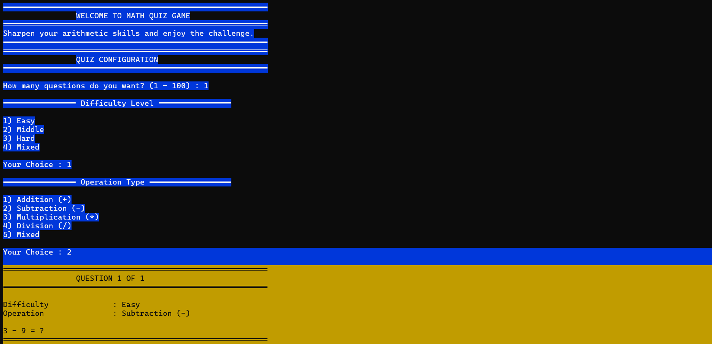
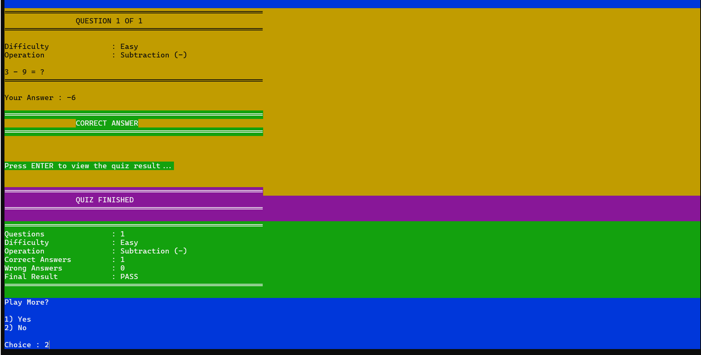
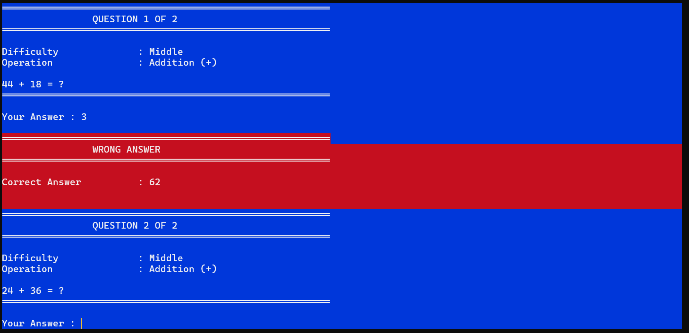
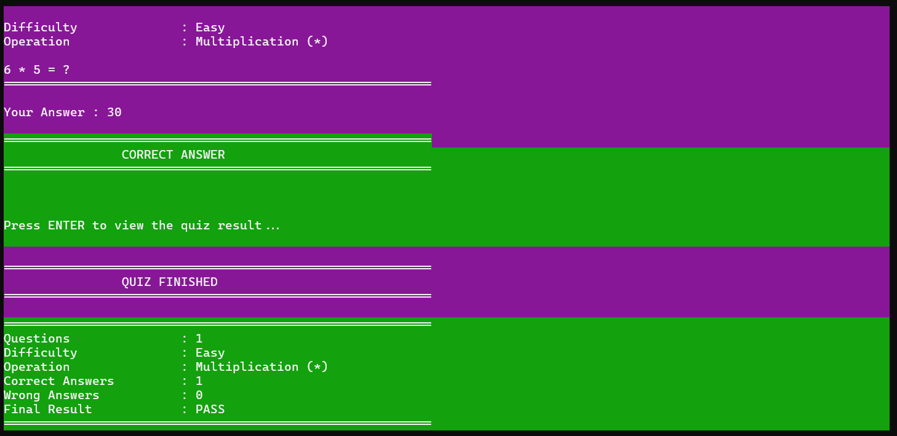
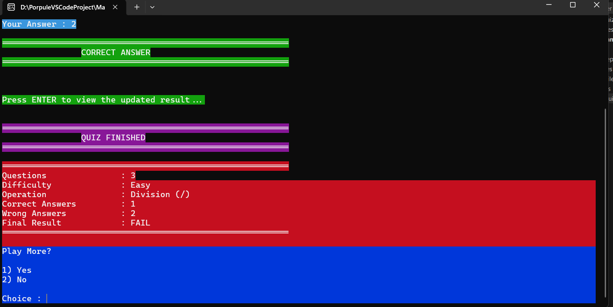
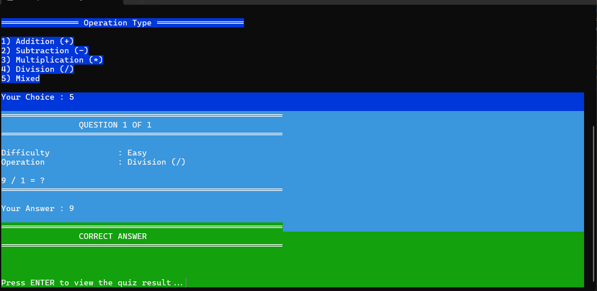
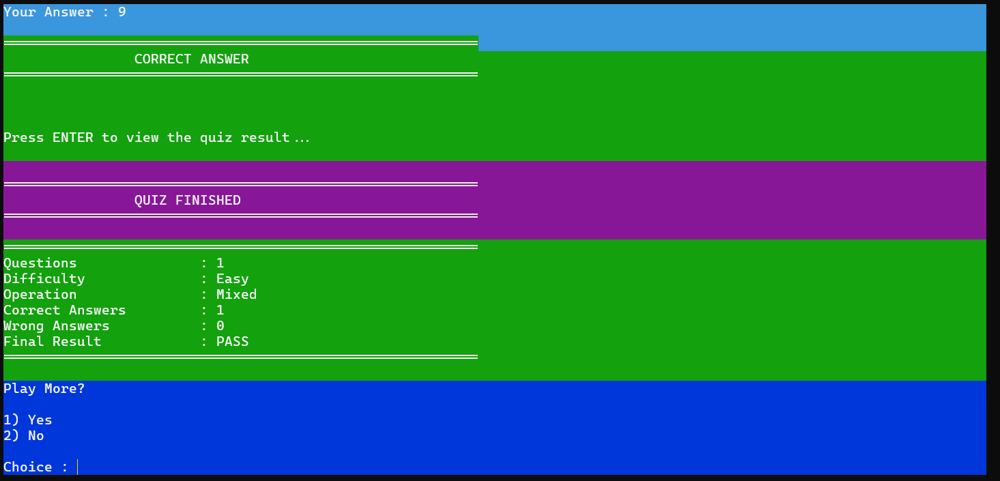

# 🧮 Math Quiz Game (C++)

A simple console-based Math Quiz Game developed in **C++** using **Visual Studio 2022**.

This project was built as part of my C++ learning journey to practice fundamental programming concepts such as functions, structs, enums, arrays, loops, switch statements, input validation, random number generation, and console formatting.

---

# 📖 About The Project

Math Quiz Game is an interactive console application that generates random mathematical questions based on the player's selected difficulty level and operation type.

After each answer, the program immediately checks whether the answer is correct. At the end of the quiz, a complete summary is displayed showing the player's performance, including the number of correct and wrong answers, along with the final result.

---

# ✨ Features

- Select the number of questions (1–100)
- Choose the difficulty level:
  - Easy
  - Medium
  - Hard
  - Mixed
- Choose the operation type:
  - Addition
  - Subtraction
  - Multiplication
  - Division
  - Mixed
- Random question generation
- Instant answer validation
- Final quiz summary
- Display detailed question history
- Option to start a new quiz
- Colored console interface
- Clean and beginner-friendly source code

---

# 🛠 Technologies Used

- C++
- Visual Studio 2022
- Windows Console API

---

# 📚 C++ Concepts Practiced

This project demonstrates the use of:

- Functions
- Structs
- Enums
- Arrays
- Loops
- Switch Statements
- Input Validation
- Random Number Generation
- Console Formatting
- Basic Windows Console Colors

---


---

# 🚀 How To Run

1. Open the solution file:

```text
Math-Quiz-Game-CPP.sln
```

2. Select one of the following configurations:

```text
Debug | x64
```

or

```text
Release | x64
```

3. Build the project.

4. Run the application.

---

# 🎮 Game Flow

1. Start the application.
2. Select the number of questions.
3. Choose the difficulty level.
4. Choose the operation type.
5. Answer each generated question.
6. View the final quiz summary.
7. Start a new quiz or exit.

---

# 📸 Screenshots

## Screen (1)



---

## Screen (2)



---

## Screen (3)



---

## Screen (4)



---

## Screen (5)



---

## Screen (6)



---

## Screen (7)



---

# 🎯 Educational Purpose

The purpose of this project is to practice fundamental C++ programming concepts by building a complete console application.

The implementation intentionally avoids advanced C++ techniques in order to keep the code simple, readable, and suitable for beginners.

---

# 🔮 Future Improvements

Possible future enhancements include:

- Add a timer for each question
- Save quiz results to a file
- Store player statistics
- Add more mathematical operations
- Improve the console interface
- Add difficulty customization

---

# 👨‍💻 Author

**Mostafa Tonin**

---

# 📄 License

This project is open-source and intended for learning and educational purposes.